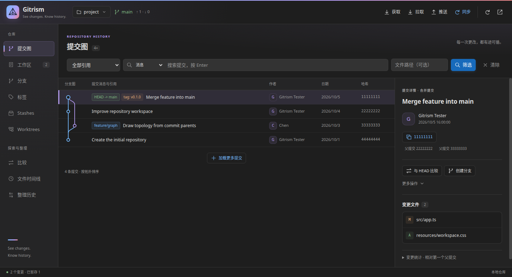
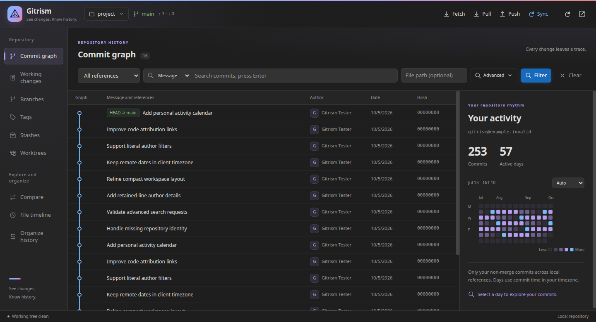
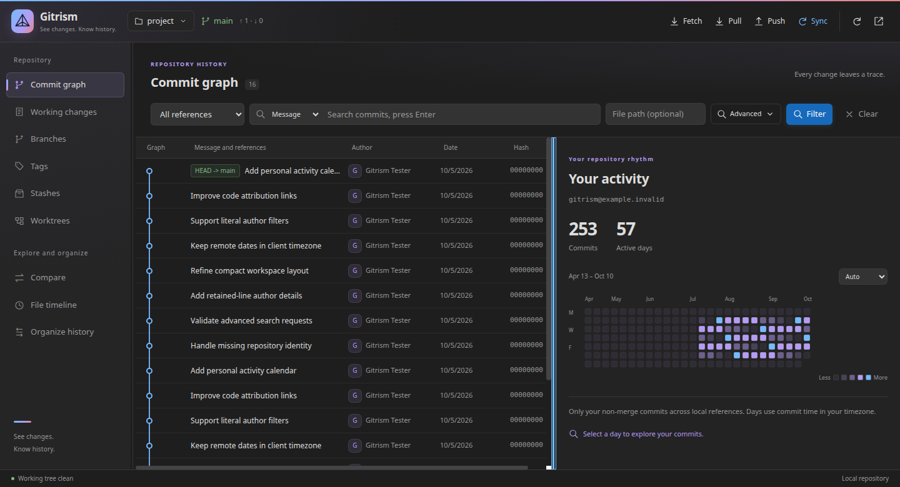
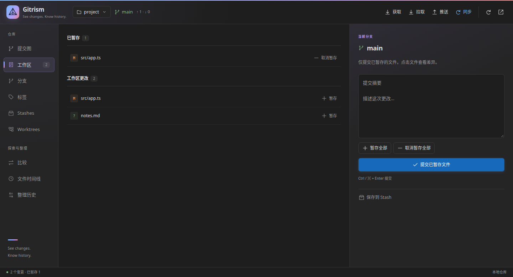

# Gitrism

**See changes. Know history.**

Gitrism is a personal Git workspace for Visual Studio Code. Explore commit history, inspect changes, manage branches and worktrees, and organize commits using your local Git installation.

No account or subscription is required. Gitrism has no telemetry, external avatar requests, AI service, or cloud backend.

## Workspace preview

Commit history and details in a dark theme:



With no commit selected, the right pane shows your own activity:



These previews use sample repository data. Colors follow your VS Code theme.

## Features

- **Commit graph:** actual parent relationships, branch and merge lanes, reference labels, and incremental loading of up to 2,000 commits.
- **Advanced search:** combine message, author, reference, and file filters with a date range, multiple authors, merge modes, first-parent traversal, and personal commits.
- **Commit details:** full messages, author information, parent navigation, change statistics, and file status including renames.
- **Native diffs:** open changed files in VS Code's diff editor, including added and deleted files, the staging area, and working changes.
- **Working changes:** separate staged, unstaged, untracked, and conflicted files; stage or unstage individual files; preserve commit drafts across refreshes.
- **Branches and tags:** create and switch branches, safely delete merged local branches, browse remote branches, and create or delete local tags.
- **Reference comparison:** compare branches, tags, or commits; inspect final file differences and counts of commits unique to either side.
- **Stashes:** save work including untracked files, inspect saved changes, apply, pop, or delete entries.
- **Worktrees:** list and create worktrees, open them in a separate window, and remove them without forcing away local changes.
- **History operations:** cherry-pick, revert, merge, and rebase, with continue and abort controls when an operation is in progress.
- **Interactive rebase:** preview a linear history plan, reorder commits, squash, fixup, or drop them; create a backup branch before applying the plan.
- **File timeline:** follow renames through up to 500 commits, inspect monthly commit counts, and open commit details and diffs.
- **Editor CodeLens:** function and class attribution, clickable retained-line commits, author breakdowns grouped by email, and file history.
- **Personal activity:** an adaptive 13/26/52-week calendar beside the graph, counting only your non-merge commits; select a day to explore them.
- **Blame and line history:** current-line or whole-file annotations, hover details, commit navigation, and history for selected lines.
- **Multiple repositories:** select workspace repositories and nested repositories discovered by VS Code's built-in Git extension.
- **Remote operations:** fetch, pull with `--ff-only`, push, and sync using existing Git credentials, with an optional SSH SOCKS5 proxy.

The editor graph and bottom panel share the same workspace interface. Navigation and history/detail dividers can be dragged to resize the panes. The interface follows the VS Code display language, supports English, Simplified Chinese, and Traditional Chinese, and combines an original prism identity with the active VS Code theme. Navigation moves from a sidebar to a horizontal strip in narrow windows and short panels. Compact graph rows keep history readable, with author, date, and hash available in commit details.

## Adjustable layout

Drag the divider beside the navigation sidebar to change its width. Drag the divider between history and details to give either pane more room; the graph and file timeline share the same detail proportion. Width limits keep both panes usable, and your preferences survive refreshes, repository changes, and webview recreation within the same view. The editor view and bottom panel keep their own preferences.

In narrow windows, navigation becomes a horizontal strip, and the graph/details divider moves between the stacked panes. Drag it up or down to adjust the graph height. Widening the activity pane also updates its automatic calendar period.

Double-click a divider or focus it and press Enter to restore its responsive default. Arrow keys make small adjustments; hold Shift for larger steps. Home and End select the size limits. Press Escape during a drag to cancel it.



## Working changes

Stage files, inspect diffs, and compose commits from the same workspace:



## Install

Download [`gitrism-0.4.1.vsix`](https://github.com/SunboTax/Gitrism/releases/tag/v0.4.1) from the repository's Releases page.

In VS Code, choose **Extensions: Install from VSIX...**, or run:

```bash
code --install-extension gitrism-0.4.1.vsix --force
```

For Remote SSH, install the extension on the remote Extension Host. Reload the window after installation if VS Code requests it.

## Getting started

Open a Git repository and select the **Gitrism** tab in the bottom panel. You can also run **Gitrism: Open Bottom Panel** or **Gitrism: Open Commit Graph** from the Command Palette.

Click the repository name to switch repositories. Select a commit to inspect its details, then click a changed file to open a native diff. In the working changes view, stage the files you want to commit and enter a message. Only staged changes are committed.

Editor context menus provide file history, line blame, an inline blame toggle, and history for selected lines.

## Code provenance

CodeLens is enabled by default above functions, methods, classes, interfaces, and enums identified by the language extension. Click the author/date lens to open the latest commit represented in those retained lines. Click the author count to inspect a breakdown by email and open a related commit. A file-history lens is also available; files without language symbols use file-level attribution.

Attribution describes the lines currently retained in the file. It does not count deleted code or every historical contributor. Saved changes that have not been committed are identified separately; unsaved documents are skipped to avoid stale line positions. Untracked files have no attribution.

## Advanced search and personal activity

Choose **Advanced** in the graph filters to select dates, authors, a merge mode, first-parent traversal, or **Only my commits**. Separate authors with semicolons. Author filters match literal text without case sensitivity and accept any listed author; message, date, merge, and path filters combine with them. Dates include the full selected days in your client timezone and filter the Git committer timestamp. First-parent traversal follows the first parent from each selected reference; focus on one branch to isolate its integration history.

When no commit is selected, the right pane displays your activity across reachable local references, including fetched remote branches and a detached HEAD. The calendar defaults to 13 weeks in a narrow pane and adapts to 26 or 52 weeks when space permits. You can also choose the period explicitly. Clicking a day applies your exact email, that day's date range, and the non-merge filter. Use **Back to your activity** in commit details to return to the calendar.

Personal identity comes from `git config user.email` in the current repository, with an exact, case-insensitive email match. Collaborators, including people with the same name, are excluded. Merge commits, synthetic stash commits, and Git notes are excluded, and commits reachable through multiple references count once. Missing identity shows a configuration hint. The calendar measures local authored commits by committer date; it does not include GitHub issues, pull requests, or other server activity. Commits made with other email addresses are not included.

## Language

Gitrism follows the display language selected in VS Code. English, Simplified Chinese (`zh-CN`), and Traditional Chinese (`zh-TW`) are supported; other display languages use English.

Run **Configure Display Language** from the Command Palette, select a language, and restart VS Code when prompted. The workspace interface, sidebar, commands, settings, prompts, notifications, and dates use the selected language. Remote SSH uses the VS Code client display language as well.

Commit messages, author names, references, paths, and raw Git output retain their original text. The brand slogan remains in English. No separate Gitrism language setting is needed.

See [localization notes](docs/localization.md) for translation maintenance.

## Settings

CodeLens is enabled independently of inline blame. Its default limits are 5,000 lines and 100 symbol locations per file:

```json
{
  "gitrism.codeLens.enabled": true,
  "gitrism.codeLens.maxLines": 5000,
  "gitrism.codeLens.maxSymbols": 100
}
```

VS Code's `editor.codeLens` setting must also be enabled. Set `gitrism.codeLens.enabled` to `false` to hide Gitrism lenses.

Inline blame defaults to the current line when enabled:

```json
{
  "gitrism.inlineBlame.enabled": true,
  "gitrism.inlineBlame.mode": "currentLine",
  "gitrism.inlineBlame.maxLines": 1000
}
```

Set `gitrism.inlineBlame.mode` to `allLines` to annotate the whole file. Annotations are cleared while a document contains unsaved changes.

If SSH access depends on a SOCKS5 proxy configured only through a shell alias, configure it explicitly for the Extension Host:

```json
{
  "gitrism.sshProxy": "127.0.0.1:7890"
}
```

Leave the proxy setting empty to use the system SSH configuration. Remote Git operations use noninteractive credentials and a 60-second timeout.

Settings from the earlier Git Atlas installation are imported once where the corresponding Gitrism setting has not already been configured.

## Organizing history

In the history planning view, enter a base reference such as `HEAD~3`, or select a commit and choose the action to organize its subsequent history. The base commit remains in place; the plan covers commits after it through `HEAD`, ordered from oldest to newest.

Use the arrows to reorder commits and choose `pick`, `squash`, `fixup`, or `drop`. `squash` keeps the combined messages; `fixup` keeps the preceding message. The working tree must be clean, the range must be linear, and a plan may contain at most 100 commits.

Before applying a plan, Gitrism validates the current branch, tip, and commit set, then creates a local `gitrism-backup/...` branch. If conflicts occur, resolve and stage the files, then continue or abort the operation.

This release does not support rewording, merge-preserving interactive rebase, or selecting a mainline parent when cherry-picking or reverting a merge commit. Commit details show merge changes relative to the first parent.

## Development

Requirements: VS Code 1.85 or later, Git 2.25.1 or later, and Node.js 22 or later for the current development toolchain.

Git versions before 2.36 do not support `worktree list -z`. Gitrism detects this and uses the older porcelain format. Git 2.25.1 does not report lock or prune reasons in that format, but Git still enforces worktree locks when removing a worktree. A worktree discovery failure is shown in the Worktrees view while repository status and commit history remain available.

```bash
npm ci
npm run check
npm test
npm run package
```

Press `F5` in VS Code to launch an Extension Development Host. The package command creates `gitrism-0.4.1.vsix` locally; it does not publish the extension.

Tests create temporary Git repositories and cover topology, file paths and renames, staging, comparisons, stashes, worktrees, conflicts, and interactive rebase. CodeLens tests cover symbol ranges, email grouping, stale reads, and caching; calendar tests cover local dates and daylight saving transitions. Browser tests use Chrome to verify the real DOM, content security policy, escaping, draft persistence, themes, narrow layouts, mouse dragging, keyboard resizing, layout persistence, and scroll preservation.

Set `GITRISM_CHROME` if Chrome is installed at a different path. Browser tests report a skip when Chrome is unavailable. Screenshots are written to language subdirectories under `/tmp/gitrism-preview` by default; override this with `GITRISM_SCREENSHOTS`.

## Scope and privacy

Git reads, diffs, and history analysis happen locally. Network operations occur when you request fetch, pull, push, or sync and use the repository's configured remotes. Git hooks and credential helpers follow the local Git configuration.

Gitrism independently implements common Git workflows. It does not include GitLens code or assets, modify GitLens, or bypass subscription checks. See [feature scope and roadmap](docs/feature-scope.md) for current limits and planned work, including pull request integrations, patch workflows, and optional AI assistance.

Gitrism is not affiliated with or endorsed by GitKraken or the maintainers of other Git extensions. Product names and marks belong to their respective owners. See the [preliminary intellectual property review](docs/ip-review-2026-10-05.md) for the checks performed and their limitations.

## Community

社区友链:[LNUXDO](https://linux.do/)--新一代极客与开源探索技术社区，真诚、友善、团结、专业。

## License

[MIT](LICENSE).
